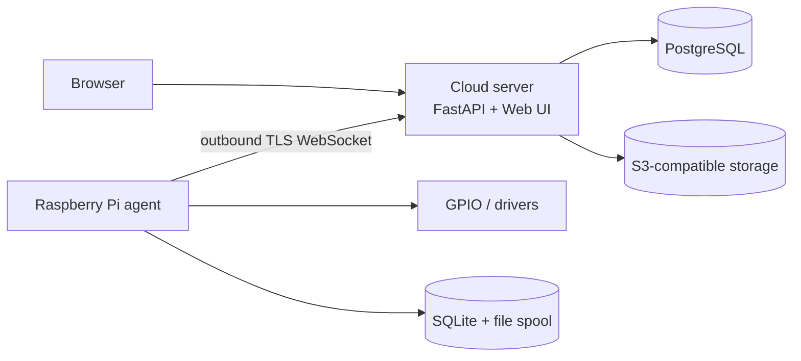

# Sam's Lab

## Purpose

Sam's Lab is a secure, offline-capable home-automation platform. Its first deployment pairs a Raspberry Pi 5 agent with a small cloud server; its architecture deliberately supports additional sites, agents, and device types.

## Scope

The repository contains the architecture documentation, a production-ready cloud-server foundation, three implemented business domains — the Device Registry (logical device/capability inventory over REST), the Command domain (immutable command lifecycle, results, and events — intent management only, with no device communication), and Auth (JWT authentication plus role/permission-based authorization for both human users and devices) — an application layer that orchestrates cross-domain use cases so no two domains ever call each other directly, a WebSocket Gateway providing one persistent, authenticated connection per device (transport only: it never executes a command or accesses a repository directly), and a Command Dispatcher that discovers pending commands, delivers them to connected devices over that gateway, and tracks acknowledgement/execution with retry and timeout handling (coordination only: it never executes a command itself). No REST route yet requires authentication; the WebSocket Gateway does. Raspberry Pi sensor telemetry and actual command execution on-device remain future implementation phases — the server side of dispatch is now fully wired end to end.

## Architecture

The cloud server exposes the web UI, REST API, authenticated WebSocket endpoint, and operational services. It owns PostgreSQL and object-storage integration. Each Pi runs an outbound-only Python agent with local SQLite and a durable file spool. Shared, versioned protocol models define all agent/server messages.



## Design Decisions

- Clean Architecture: domain and application services do not depend on FastAPI, databases, or GPIO libraries.
- Async networking, explicit dependency injection, typed Pydantic boundary models, and repository-backed persistence.
- The agent never exposes Internet-facing ports and never connects directly to PostgreSQL.
- Commands are idempotent where practical and have durable lifecycle records.

## Repository Layout

| Path | Responsibility |
| --- | --- |
| `server/` | Cloud-server application (FastAPI, the only implemented backend) |
| `frontend/` | Operator console (React + TypeScript SPA) for the cloud server's REST API |
| `agent/` | Raspberry Pi agent framework, plugins, and command runtime |
| `shared/` | Protocol and cross-process contracts shared by server and agent |
| `deployment/` | Production packaging: `docker/` (backend + frontend images, Compose, deploy/rollback/backup scripts) and `systemd/` (agent unit file) |
| `infrastructure/` | Deployment, service, and monitoring definitions |
| `scripts/` | Development and operational helpers |
| `tests/` | Automated tests, mirroring application boundaries |
| `docs/` | Architecture, agent, and development documentation |

## Technology Stack

Python 3.13, FastAPI, React/TypeScript, PostgreSQL, SQLite, WebSockets over TLS, S3-compatible object storage, Grafana, VictoriaMetrics, vmagent/vmauth, MediaMTX, Prometheus-format metrics, Docker, Caddy, nginx, systemd, and Raspberry Pi 5 hardware.

## Deployment

The cloud VM uses a **hybrid deployment model**: PostgreSQL, VictoriaMetrics, vmagent, vmauth, MediaMTX, and Caddy run as native systemd services; only the backend and frontend are containerized, as exactly two Docker Compose services (`deployment/docker/`). Caddy is the sole internet-facing process — both containers bind to `127.0.0.1` only, and application code never assumes `localhost` reaches a native service, since that resolves to the container itself.

Routine deployment needs only:

```bash
git pull
./deployment/docker/deploy.sh
```

which builds both images, runs database migrations, starts containers, verifies every dependency (backend, frontend, PostgreSQL, MediaMTX, VictoriaMetrics), and automatically rolls back on failure. See [Operations](OPERATIONS.md) for the full runbook (upgrade, rollback, logs, health, backup/restore, troubleshooting) and [Deployment architecture](docs/architecture/DEPLOYMENT.md) for the design rationale.

## Development Workflow

Read [the architecture](docs/architecture/ARCHITECTURE.md) and the relevant ADR before a change. Implement from the inside out (domain, service, repository/driver adapter, delivery layer), add typed tests, run the configured checks, and update documentation in the same change.

## Future Vision

Sam's Lab grows from one trusted Pi into a multi-agent automation fabric with pluggable drivers for sensors, relays, pumps, cameras, LEDs, ESP32 bridges, and additional sites.

## Future Considerations

Tenant boundaries, remote fleet management, rule authoring, media processing, and agent update orchestration remain future capabilities.

## Open Questions

- Will a future identity provider (delegated auth/SSO) replace or supplement the current local username/password `users` table?
- Which S3-compatible provider and retention costs are acceptable?
- What is the first supported hardware inventory?

## References

- [Architecture](docs/architecture/ARCHITECTURE.md)
- [Deployment](docs/architecture/DEPLOYMENT.md)
- [Operations runbook](OPERATIONS.md)
- [Protocol](docs/architecture/PROTOCOL.md)
- [Contributing](docs/development/CONTRIBUTING.md)
