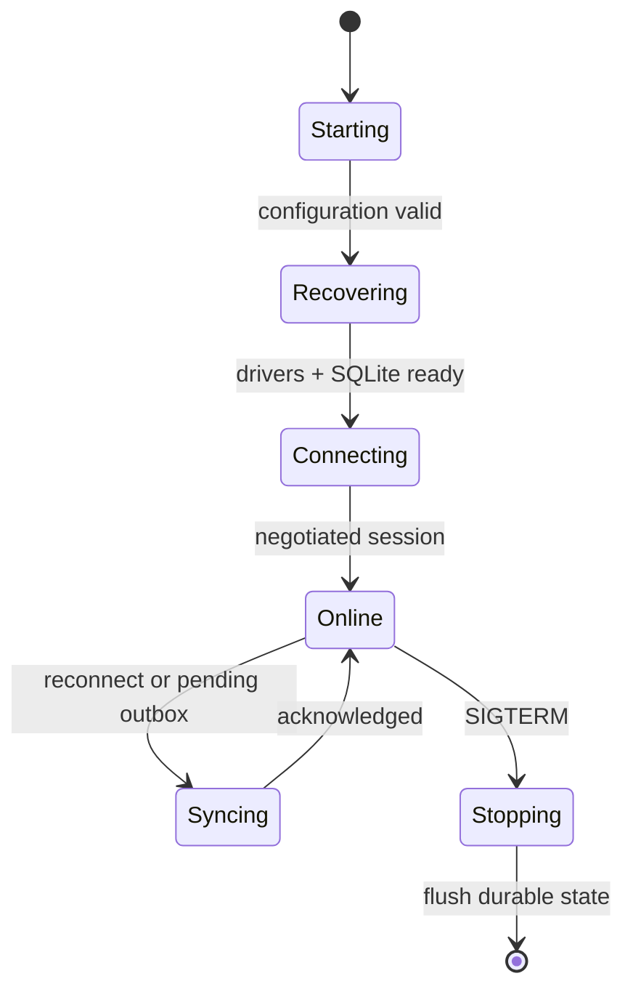
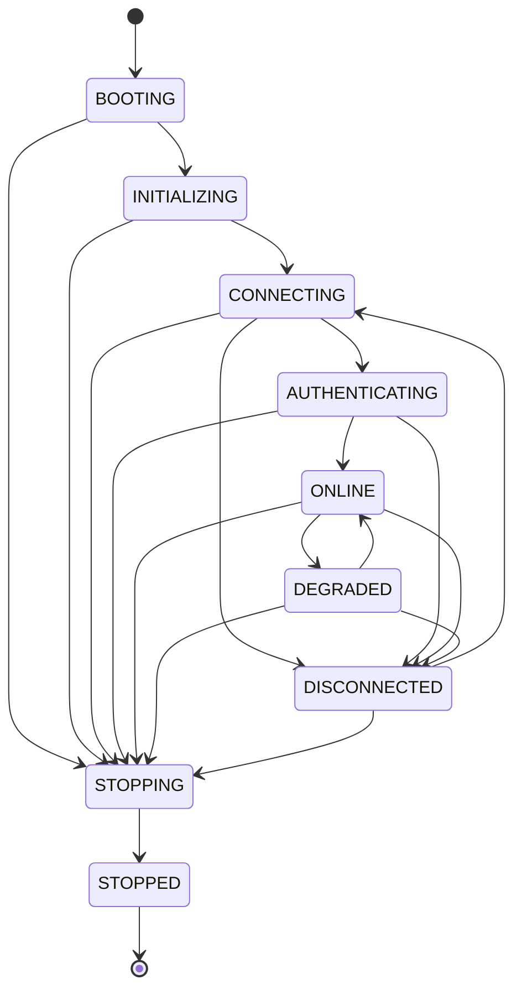
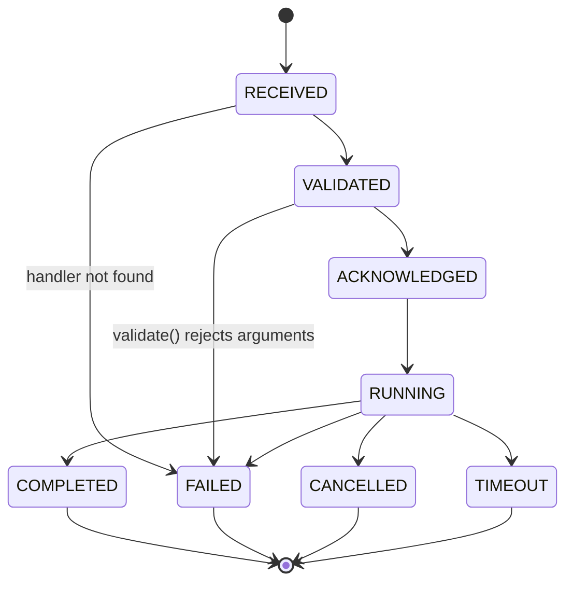

# Agent Design

## Purpose

Define the Raspberry Pi agent as a resilient edge execution service.

## Scope

Startup, shutdown, connection lifecycle, commands, drivers, local state, uploads, and configuration.

## Architecture

At startup, systemd launches the least-privileged agent; it validates configuration, opens SQLite, recovers the spool, loads registered drivers through dependency injection, exposes local metrics, and begins an outbound TLS connection loop. After `HELLO`/`WELCOME`, it replays durable outbox records, maintains heartbeat, accepts commands, and reports results/events.

Command dispatch validates schema, expiry, authorization context, capability, and idempotency before routing only to a driver-facing service. It durably persists the acceptance/result around execution. Reconnect uses exponential backoff with jitter and treats server messages as untrusted until validated. Shutdown stops new work, marks/drains safe work, persists pending responses, closes drivers, and exits within systemd limits.

Camera capture is a driver pipeline: request, capture locally, checksum and spool, request upload authorization, transfer, report metadata, and retain/retry safely. Configuration is environment/file based, typed and validated at startup; no secret is logged.

## Agent Framework (implemented, Phase 1)

The sections above describe the eventual agent, including SQLite, drivers, and camera capture — none of which exist yet. What is implemented today is the production-ready **framework** the rest builds on: process lifecycle, connection management, protocol handling, plugin loading, logging, metrics, health, and (as of Phase 2, below) command execution — with no hardware. `agent/` is its own installable package (own `pyproject.toml`, own `pythonpath`) so its `app.*` namespace never collides with the server's `server/app/`; it depends on `shared/protocol/` for the wire format, never redefining it.

`agent/app/` is organized the same way as `server/app/`, one focused package per concern:

| Package | Owns |
| --- | --- |
| `config/` | `AgentSettings` (Pydantic Settings): `SERVER_URL`, `DEVICE_NAME`/`DEVICE_DISPLAY_NAME`/`DEVICE_DESCRIPTION`, `DEVICE_CLIENT_ID`/`DEVICE_PRIVATE_KEY`/`AUTH_TOKEN_URL` (device identity — see below), `LOG_LEVEL`, `HEARTBEAT_INTERVAL`, `RECONNECT_INTERVAL`, `PROTOCOL_VERSION`, `LOCAL_DATA_DIRECTORY`/`CACHE_DIRECTORY`/`TMP_DIRECTORY`. `load_settings(overrides)` layers explicit CLI overrides on top of environment/`.env`, since Pydantic Settings' init source already outranks both. |
| `state/` | The explicit lifecycle state machine (below): `AgentState`, `ALLOWED_TRANSITIONS`, `ensure_transition_allowed()`, `StateMachine` (with listener callbacks). |
| `protocol/` | Pure envelope construction/parsing for `HELLO`/`WELCOME`/`PING`/`PONG`/`ERROR`/`GOODBYE`, built on `shared/protocol/`. No I/O, no business logic — `COMMAND` is intentionally absent here. |
| `connection/` | `ConnectionManager` — `connect()`/`authenticate()`/`send()`/`receive()`/`heartbeat()`/`disconnect()`/`reconnect()` — plus `ExponentialBackoff` and the `WebSocketConnection` transport seam (a `Protocol`, so tests never need a real socket). `token_provider.py`'s `fetch_device_token` signs a fresh JWT assertion with `DEVICE_PRIVATE_KEY` and exchanges it for an access token (`POST {AUTH_TOKEN_URL}`) on *every* `authenticate()` call — not once at startup — so a reconnect always succeeds no matter how long the agent was disconnected. This replaced a static, pre-issued `DEVICE_TOKEN` (15-minute TTL by default) that, once expired with no live connection, left the agent with no way to ever reconnect on its own; see `docs/architecture/SECURITY.md`. |
| `dispatcher/` | `MessageDispatcher` — routes one received envelope to the handler registered for its `message_type`; an unregistered type is logged and ignored, never an error. `MessageType.COMMAND` is registered to `CommandDispatcher.handle_command` (below) — the one seam between transport and the command runtime. |
| `commands/` | The command runtime (Phase 2, below): receive, validate, acknowledge, dispatch, execute, report. Transport-independent — see its own section. |
| `services/` | `SessionState` — the agent's own in-memory view of its connection: connected/authenticated, connection ID, protocol/agent/server version, last heartbeat (+ ack), connection duration. Never persisted. |
| `plugins/` | The plugin framework: `Plugin` base class (capabilities, `on_startup`/`on_shutdown` hooks, `check_health()`), `PluginManager` (registration, ordered startup, reverse-ordered shutdown, aggregated health). Two real plugins register here today — `camera` (live streaming/snapshot/recording, see [Camera](CAMERA.md)) and `pump` (single-pulse GPIO triggering of a timer relay, see [Pump](PUMP.md)) — a future scheduler/additional-relay driver follows the same shape. |
| `health/` | `HealthService` and five checks (connection, configuration, plugins, memory, disk) combined into one `HealthState` (`HEALTHY`/`DEGRADED`/`UNHEALTHY`) via `combine_states()` (worst-of-all). Memory/disk use stdlib (`/proc/meminfo`, `shutil.disk_usage`) rather than a new dependency. |
| `lifecycle/` | `Agent` (the orchestrator) and `build_agent()`/`build_health_service()` (the composition root, which also wires up the command runtime). Owns startup, the concurrent heartbeat/receive loops, reconnect-on-failure, and graceful shutdown (including draining in-flight commands). |
| `logging/` | structlog JSON configuration; `bind_context()`/`clear_context()` bind `device_id`/`connection_id`/`message_id`/`correlation_id`/`trace_id` onto every subsequent log event. |
| `metrics/` | Process-global Prometheus metrics (the same deliberate, narrow exception to "no module-level singletons" the server's own gateway/dispatcher metrics use): `agent_uptime_seconds`, `agent_connected`, `connection_attempts_total`, `heartbeat_total`, `heartbeat_failures_total`, `reconnect_total`, `messages_sent_total`/`messages_received_total` (labeled by `message_type`). |
| `system/` | `install_shutdown_handlers()` (SIGTERM/SIGINT → graceful stop) and `ensure_directories()` (creates the configured data/cache/tmp directories). |
| `cli/` | `samslab-agent`: `start`, `version`, `health`, `config`, `validate-config` — plain `argparse`, not a new dependency. |
| `utils/` | `AGENT_VERSION`, reported in `HELLO` and the `version` command. |

### Lifecycle state machine

Same pattern as the Command domain's own state machine (`server/app/domains/commands/service.py`): a plain transition table plus one guard function every transition goes through.

`STOPPING`/`STOPPED` are reachable from almost every state, so shutdown is never blocked by an in-progress connection attempt; `STOPPED` is terminal. An invalid transition raises `InvalidStateTransitionError` rather than silently no-opping.

### Startup, reconnect, and heartbeat

`Agent.run()` transitions `BOOTING → INITIALIZING`, runs every plugin's `on_startup()`, then loops: connect (retrying through `ConnectionManager.reconnect()`'s exponential backoff until it succeeds or a stop is requested), then run the heartbeat and receive loops concurrently until either ends. Only the very first connection attempt of the process's lifetime is a bare, immediate `connect()` — every attempt after that, whether the first one failed or an established connection was later lost, goes through `reconnect()`, so a dropped connection always backs off rather than hot-looping. A lost connection (a `receive()`/`heartbeat()` failure) is logged, the transport is closed, and the outer loop reconnects; a server-initiated `GOODBYE` or a signal-driven `request_stop()` transitions to `STOPPING` and shuts down cleanly — plugins' `on_shutdown()` hooks run in reverse registration order, then the state machine reaches `STOPPED`.

### systemd deployment

`deployment/systemd/samslab-agent.service` runs the agent as a dedicated non-root user (`Restart=always`, `RestartSec=5`, hardened with `ProtectSystem=strict`/`ProtectHome=true`/`NoNewPrivileges=true`), using systemd's `StateDirectory=`/`CacheDirectory=` to create `/var/lib/samslab-agent`/`/var/cache/samslab-agent` with correct ownership before the process starts — matching `AgentSettings`' own defaults for `LOCAL_DATA_DIRECTORY`/`CACHE_DIRECTORY`. `ensure_directories()` (called from the CLI's `start` command) creates `TMP_DIRECTORY` as a fallback for the same reason. Logs go to stdout/stderr, captured by journald (`StandardOutput=journal`, `SyslogIdentifier=samslab-agent`) — no separate log-shipping is configured in this phase. The unit also orders itself `After=time-sync.target`, not just `network-online.target`: a device with no battery-backed RTC can boot with a badly-wrong system clock, which makes the JWT-bearer assertion `fetch_device_token` signs on every connection attempt (`iat`/`exp`) look invalid to the server until `systemd-timesyncd` completes its first sync — confirmed live as several minutes of `401 Unauthorized` on `POST /auth/device/token`, indistinguishable from the agent being stuck offline. `time-sync.target` only actually blocks on that first sync if `systemd-time-wait-sync.service` is enabled (disabled by default on Raspberry Pi OS); a deployment must `systemctl enable systemd-time-wait-sync.service` for this ordering to have any effect. Journald persistence (`Storage=persistent` in `/etc/systemd/journald.conf`, plus `/var/log/journal/` actually initialized via `systemd-tmpfiles --create --prefix /var/log/journal`) is a deployment prerequisite, not optional — without it, the runtime journal lives only in `/run` and is lost on every reboot, which is exactly what made a real incident's root cause undiagnosable until this was fixed.

## Command Runtime (implemented, Phase 2)

`agent/app/commands/` is a modular, transport-independent framework for receiving, validating, acknowledging, dispatching, executing, and reporting on commands. It never imports the WebSocket connection or anything hardware-specific; `CommandDispatcher.handle_command` is simply registered on the transport-level `MessageDispatcher` for `MessageType.COMMAND` (in `app/lifecycle/factory.py`), exactly like `PING`/`PONG`/`ERROR`/`GOODBYE` are registered directly on `Agent`. See [Commands](COMMANDS.md) for the full lifecycle/protocol detail; this section is the code-shape summary.

| File | Owns |
| --- | --- |
| `handler.py` | The `CommandHandler` ABC every command implements: `command_type` (identity), `validate()`/`execute()` (mandatory — a handler must explicitly accept or reject its own arguments), `supports()`/`timeout()` (overridable, sensible defaults). The runtime only ever calls through this interface — it never knows a handler's own implementation. |
| `registry.py` | `CommandRegistry` — `register()`/`unregister()`/`find_handler()`/`list_handlers()`. `register()` raises `DuplicateHandlerError` on a repeated `command_type`; `find_handler()` is an O(1) dict lookup by `command_type`, falling back to scanning `supports()` only for a handler registered under a different key (e.g. a future wildcard handler). No switch statement or `if command_type == ...` chain anywhere — a new command type is always just a new registered handler. |
| `context.py` | `CommandContext` (frozen) — command/correlation/trace IDs, device metadata, `AgentSettings`, a bound structlog logger, the metrics module, and `CommandServices` (frozen: `plugin_manager`, `health_service`, `registry`, `agent_started_at`, `camera_service`, `pump_service` — the "application services" a handler is allowed to call; each is added here, never imported by a handler directly). `build_command_context()` builds one fresh per command. |
| `executor.py` | `CommandExecutor` — runs `handler.execute()` as its own tracked `asyncio.Task`: `asyncio.wait_for(..., timeout=handler.timeout())` for timeouts, `cancel(command_id)` for explicit cancellation, `ExecutorConfig(max_retries=0)` for retries (disabled by default; only a `FAILED` outcome is ever retried — `TIMEOUT`/`CANCELLED` never are), and metrics/duration recording around every outcome. |
| `dispatcher.py` | `CommandDispatcher.handle_command` — the one seam to the transport. Parses `CommandPayload`, then hands the rest of the pipeline (lookup → `validate()` → `COMMAND_ACK` → execute → `COMMAND_RESULT`) off as its own `asyncio.Task` and returns immediately, so one command never blocks another or the receive loop. A top-level `except Exception` around the whole pipeline is the transport's safety net — nothing from command execution ever reaches the WebSocket connection. `aclose()` cancels any commands still in flight, called from `Agent._shutdown()`. |
| `result.py` | `CommandResult` (frozen) — `CommandResultStatus` (`SUCCESS`/`FAILED`/`CANCELLED`/`TIMEOUT`), duration, structured `result` data, `error_message`, `stack_trace` (populated only when `AgentSettings.debug` is true), and a shell-convention `exit_code` (0/1/124/130). Richer than the wire's `CommandResultPayload` (`success`/`result`/`error_message` only) — the dispatcher maps one to the other when it actually sends `COMMAND_RESULT`, so the existing wire schema never needed to change. |
| `lifecycle.py` | `CommandLifecycleState` (`RECEIVED → VALIDATED → ACKNOWLEDGED → RUNNING →` one terminal state) plus `ALLOWED_TRANSITIONS`/`ensure_transition_allowed()` — the same explicit-table-plus-guard pattern as `app/state/machine.py` and the cloud server's own command state machine. `CommandLifecycle` tracks one command's state and publishes a `CommandEvent` on every transition. |
| `events.py` | `CommandEventBus` — synchronous, in-process subscribe/unsubscribe/publish keyed by `CommandLifecycleState`, scoped to this package (not the same bus a future cross-cutting agent event system might use). |
| `validators.py` | Reusable `validate()` helpers: `validate_command_type_format()`, `require_keys()`, `require_type()`. |
| `metrics.py` | `commands_received_total`, `commands_completed_total`, `commands_failed_total`, `commands_timeout_total` (all labeled by `command_type`), `command_execution_duration_seconds` (histogram, labeled by `command_type`), `registered_handlers`, `running_commands`. |
| `builtin.py` | The four built-in handlers (below) and `register_builtin_handlers()`. |

### The four built-in handlers

Demonstrations of the framework, no hardware — every future GPIO/camera/scheduler handler follows the same shape:

- **`system.echo`** — returns its own arguments unchanged.
- **`system.ping`** — returns `status`, `timestamp`, `agent_version`, and `uptime_seconds` (since `CommandServices.agent_started_at`).
- **`system.capabilities`** — returns registered plugins (name + capabilities), registered command handler types, the union of plugin capabilities, and versions (agent + protocol).
- **`system.health`** — returns the local `HealthService`'s current combined report.

### Command lifecycle and protocol integration

`COMMAND_ACK` is sent only once a handler has both been found and accepted the command's arguments — the same meaning it already had server-side ("agent accepts a command; promotes it to RUNNING", see [Protocol](../architecture/PROTOCOL.md)). A lookup or validation failure skips straight to a failed `COMMAND_RESULT`, with no `COMMAND_ACK` at all.

## Design Decisions

SQLite is the agent's durable synchronization boundary. Drivers are plug-ins behind narrow interfaces; the agent service, not a driver, owns retries, policy, commands, and telemetry. Blocking hardware operations are isolated from async network paths.

## Future Considerations

Capability registration, signed driver packages, local rule execution, ESP32 bridges, and managed updates can build on the driver model.

## Open Questions

What commands must continue automatically during a prolonged cloud outage?

## References

- [Protocol](../architecture/PROTOCOL.md), [Components](../architecture/COMPONENTS.md), [Data flow](../architecture/DATAFLOW.md)
- [GPIO](GPIO.md), [Camera](CAMERA.md), [Pump](PUMP.md), [Storage](STORAGE.md)
