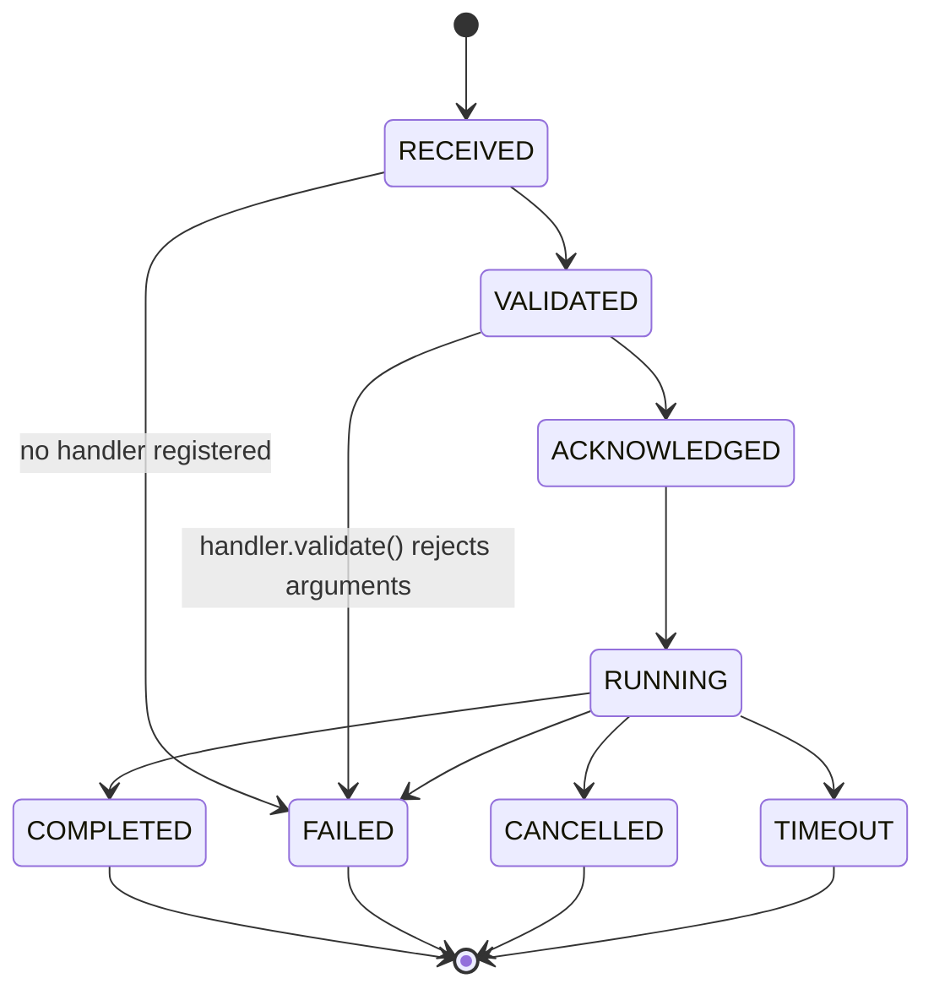

# Command Lifecycle

## Purpose

Specify command semantics from creation to terminal reconciliation, on both the server and the agent.

## Scope

All operations requested by the server. Four hardware-free `system.*` handlers (`system.echo`, `system.ping`, `system.capabilities`, `system.health`) and three camera handlers (`camera.stream.start`, `camera.stream.stop`, `camera.status` — see [Camera](CAMERA.md)) exist today; future typed commands (`gpio.pump_start`, `sensor.read`, ...) register as new handlers the same way, without changing the runtime itself; see [GPIO](GPIO.md).

## Architecture

A command contains a UUID, a dot-namespaced `command_type`, a typed `arguments` payload, and — server-side — a target device, issued/expiry timestamps, and a persisted status. **The server's and the agent's lifecycles are two different state machines, tracking two different things, and were historically documented with two different (and confusing) sets of names; this section uses the actual implemented names for both.**

### Server-side: command persistence and delivery (implemented)

`server/app/domains/commands/service.py`'s `CommandStatus` is authoritative: `PENDING → QUEUED → DISPATCHED → RUNNING → COMPLETED/FAILED/CANCELLED/EXPIRED/TIMEOUT`, enforced by an explicit `ALLOWED_TRANSITIONS` table (see [Components](../architecture/COMPONENTS.md) and [Architecture](../architecture/ARCHITECTURE.md) for the full state diagram and the Command Dispatcher that drives it). This tracks *whether the server has durably recorded and delivered* a command — it exists whether or not any agent is even connected.

### Agent-side: one command's execution (implemented, Phase 2)

`agent/app/commands/lifecycle.py`'s `CommandLifecycleState` is a **separate, agent-local, in-memory** state machine tracking *one command's journey through this specific agent process*, from the moment its `COMMAND` envelope arrives to the moment `COMMAND_RESULT` is sent:

Same explicit-table-plus-guard pattern as the server's own state machine (`ALLOWED_TRANSITIONS` + `ensure_transition_allowed()`), and every transition publishes a `CommandEvent` on the agent's own `CommandEventBus` — nothing in this table is ever persisted; it lives and dies with one command's processing task. `COMMAND_ACK` is sent only on the `VALIDATED → ACKNOWLEDGED` transition (a handler was found *and* accepted the arguments) — a lookup or validation failure goes straight from `RECEIVED`/`VALIDATED` to `FAILED` with a failed `COMMAND_RESULT`, no ack at all. See [Agent design](AGENT.md#command-runtime-implemented-phase-2) for the full file-by-file breakdown and [Protocol](../architecture/PROTOCOL.md) for the wire messages themselves.

The agent's `CommandResult` (`app/commands/result.py`) is richer than the wire's `CommandResultPayload` — it additionally carries a `CommandResultStatus` (`SUCCESS`/`FAILED`/`CANCELLED`/`TIMEOUT`), execution duration, a stack trace (development builds only, `AgentSettings.debug`), and a shell-convention exit code (0 success, 1 failure, 124 timeout, 130 cancelled). The dispatcher maps this down to the wire's simpler `success`/`result`/`error_message` shape when it actually sends `COMMAND_RESULT`, prefixing `error_message` with the status name for anything but `SUCCESS` — the wire schema itself never needed to change to support this.

### Timeouts, cancellation, and retries (implemented, Phase 2 — agent-local only)

`CommandExecutor` runs every handler's `execute()` as its own tracked `asyncio.Task`:

- **Timeout** — each handler declares its own `timeout()` (default 30s); exceeding it cancels the task and reports `TIMEOUT`.
- **Cancellation** — `CommandExecutor.cancel(command_id)` cancels a specific in-flight command and reports `CANCELLED`. This is an **agent-internal** primitive only — the wire protocol has no `CANCEL` message type yet, so the server cannot yet ask a running command to stop; wiring that through is future work (see below).
- **Retries** — `ExecutorConfig(max_retries=0)`, disabled by default. Only a `FAILED` outcome is ever retried; `TIMEOUT` and `CANCELLED` never are, since a timed-out operation may still be running side effects and a cancellation is explicit intent.

## Design Decisions

Delivery is at-least-once; effects must be idempotent where possible. For non-idempotent operations, durable command UUID lookup and explicit safety policy prevent duplicate execution. Schedules create the same command records as manual actions. The command runtime never branches on `command_type` — it only ever looks up a registered `CommandHandler`; a new command type is always a new handler registration, never a runtime change.

## Future Considerations

A wire-level `CANCEL` message so the server can ask a running command to stop (today, cancellation only happens via the agent's own internal `CommandExecutor.cancel()`, not reachable from the server). Progress streaming, compound workflows, priority queues, and device locks. Future GPIO/scheduler handlers register against the same `CommandHandler` contract the `system.*` and `camera.*` handlers already demonstrate.

## Open Questions

Which operations are safe to retry automatically, and what locks/interlocks do pumps require?

## References

- [Protocol](../architecture/PROTOCOL.md), [Components](../architecture/COMPONENTS.md), [Architecture](../architecture/ARCHITECTURE.md)
- [Agent design](AGENT.md), [GPIO](GPIO.md)
