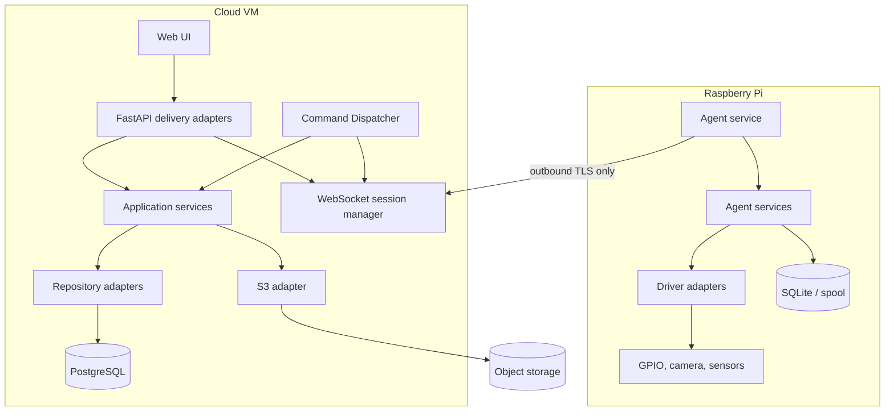
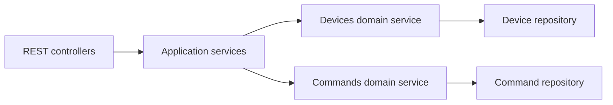
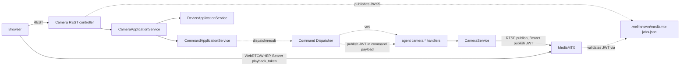

# Architecture

## Purpose

Define the target architecture for Sam's Lab and the rules that keep it secure, operable, and extensible.

## Scope

Covers the cloud server, Raspberry Pi agent, protocol, persistence, media, scheduling, recovery, and future multi-agent operation.

## Architecture

The server is the control plane and system of record. FastAPI serves REST, the web UI, and the agent WebSocket endpoint. Application services coordinate repositories, command orchestration, schedules, and file authorization. PostgreSQL contains metadata; S3-compatible storage contains immutable large objects.

The Pi is an edge execution plane. It establishes a persistent TLS WebSocket, runs drivers through adapters, and durably records unacknowledged events, results, and uploads in SQLite/spool storage. It never accepts inbound Internet traffic or accesses PostgreSQL.

The command lifecycle is: validate and persist as queued; the Command Dispatcher discovers it, delivers it to a selected connected agent, and tracks acknowledgement; agent records acceptance, executes through a driver, and sends a result; server persists the terminal state. Retries reuse the command UUID. Schedules create commands rather than invoke hardware.

### The Application Layer (implemented)

Between the REST delivery adapters and the domain services sits an **application layer** (`server/app/application/`) — not a business domain itself, but the only place cross-domain workflows are allowed to live:

A controller depends only on an application service (`DeviceApplicationService`, `CommandApplicationService`, `HealthApplicationService`) and never calls a domain service or repository directly. An application service, in turn, is the only thing allowed to call more than one domain: `CommandApplicationService` calls both `CommandService` and `DeviceService` to enforce "a command's target device must exist and be enabled" — a rule that belongs to neither domain individually. Domain services never call one another and never import the application layer.

Application services return **DTOs** (`app/application/dto/`), never a SQLAlchemy model or repository entity; the mapping is done once, in `app/application/mappers/`. Domain failures are translated into a small, domain-agnostic **application exception** hierarchy (`app/application/exceptions/`) before they ever reach REST, so `app/main.py` maps exactly one exception hierarchy to HTTP status codes regardless of which domain — or how many — were involved in a request. A lightweight in-process **event bus** (`app/application/events/`) lets application services publish lifecycle events (`DeviceRegistered`, `CommandCreated`, `UserLoggedIn`, ...) that future notification/audit/metrics/automation concerns can subscribe to without any domain or repository knowing the bus exists. Interfaces for infrastructure the application layer will eventually depend on (`Clock`, `IdGenerator`, `ObjectStorage`, `NotificationSender`, `AuditRecorder`, `CurrentUserProvider`, `UnitOfWork`) are declared in `app/application/interfaces/` now, with no concrete implementation, so those future phases implement against a stable seam.

### Auth subsystem (implemented)

`server/app/domains/auth/` implements JWT authentication and role/permission-based authorization for both principal types this platform recognizes: human users and devices (agents). It follows the same domain shape as Devices and Commands, plus three files unique to it: `jwt.py` (encode/decode), `passwords.py` (Argon2 hashing), and `tokens.py` (opaque refresh-token/client-secret generation and hashing) — none of which import FastAPI, so the same authentication core serves REST and the WebSocket Gateway alike, and could serve a future gRPC or MQTT transport identically. `dependencies.py` holds the transport-specific adapters (`CurrentUser`, `CurrentDevice`, `RequireRole`, `RequirePermission`) that other domains' controllers `Depends()` on to protect a route; the WebSocket Gateway's admin endpoints use `RequirePermission("system.admin")`, and its own agent handshake calls `decode_principal`/`JWTCodec` directly (bypassing FastAPI's `Depends()`, which has no first-class WebSocket support). See [Security](SECURITY.md) for the full JWT/RBAC/token-lifecycle design and [Database](DATABASE.md) for its tables.

### WebSocket Gateway (implemented)

`server/app/websocket/` (`gateway.py`, `manager.py`, `session.py`, `connection.py`, `router.py`, `protocol.py`, `serializer.py`, `handlers.py`, `heartbeat.py`, `metrics.py`, `exceptions.py`, `schemas.py`, `constants.py`) implements one persistent, authenticated WebSocket connection per device — transport only. It maintains authenticated sessions, negotiates protocol version, and delivers versioned protocol messages; it never executes a command, never accesses GPIO, and never accesses a repository directly. The one cross-domain call it makes is through the Application Layer (`DeviceApplicationService`, to confirm a device is enabled at handshake time and to keep `last_seen`/`status` current) — the same seam a future MQTT or gRPC transport would reuse. Sessions live only in memory (`SessionManager`); a server restart drops them, matching the domain's own stance that server state, not an agent's in-flight connection, is authoritative. `COMMAND_ACK`/`COMMAND_RESULT` messages are parsed just enough to publish `CommandAckReceived`/`CommandResultReceived` on the shared event bus — the gateway never imports or calls the Command Dispatcher directly; that one-way notification seam is what keeps the transport reusable by a future MQTT/gRPC connector. See [Protocol](PROTOCOL.md) for the wire format and connection lifecycle, and [Components](COMPONENTS.md) for file-level ownership.

### The Command Dispatcher (implemented)

`server/app/dispatcher/` is a background service, started and stopped by the FastAPI `lifespan`, that delivers commands to connected devices — coordination only, with no command semantics and no repository access of its own. It polls `CommandApplicationService.list_pending_commands()` for PENDING/QUEUED commands, holds them in an in-memory priority queue (CRITICAL > HIGH > NORMAL > LOW, FIFO within a priority), and for each one checks the WebSocket Gateway's `SessionManager` for an open session before sending — a command whose device isn't connected is simply left pending for the next poll, never a failure. A successful send calls `mark_dispatched`; the dispatcher then tracks the command until either a `CommandAckReceived` event promotes it to `mark_running` (subscribed on the same shared event bus the gateway publishes to) or an acknowledgement timeout triggers a retry with exponential backoff, and eventually `fail_command` once the retry budget is exhausted. Once RUNNING, a separate execution-timeout watch calls `mark_timeout` if `CommandResultReceived` never arrives in time; when it does arrive, the dispatcher calls `complete_command`/`fail_command` based on the reported outcome. A duplicate or late ack/result (for a command no longer tracked) is logged and dropped, never reprocessed. See [Protocol](PROTOCOL.md) for the acknowledgement/retry/timeout semantics and [Components](COMPONENTS.md) for file-level ownership.

### The Agent Framework (implemented, Phase 1)

`agent/` is the first real code on the edge side of the architecture diagram above — but only the framework, not the full driver-facing agent the rest of this document describes. It runs as its own installable package (own `pyproject.toml`) so its `agent/app/` never collides with the server's `server/app/` as a top-level `app.*` import, and depends on `shared/protocol/` for the wire format rather than redefining it. `agent/app/lifecycle/` (`Agent`) owns an explicit lifecycle state machine (`BOOTING → INITIALIZING → CONNECTING → AUTHENTICATING → ONLINE`/`DEGRADED` ⇄, `DISCONNECTED`, `STOPPING → STOPPED`, same transition-table-plus-guard pattern as the Command domain's own state machine), a `ConnectionManager` (connect/authenticate/heartbeat/send/receive/disconnect/reconnect, with exponential backoff applied to every reconnection attempt — the very first attempt only), a `MessageDispatcher` that routes `HELLO`/`WELCOME`/`PING`/`PONG`/`ERROR`/`GOODBYE` and intentionally ignores `COMMAND`, a plugin framework (capabilities, startup/shutdown hooks, health checks), structlog JSON logging, Prometheus metrics, and a local health subsystem (`HEALTHY`/`DEGRADED`/`UNHEALTHY` across connection/configuration/plugins/memory/disk). GPIO, scheduler, SQLite, and S3 code remain future work — see [Agent design](../agent/AGENT.md) for what's planned on top of this framework and [Components](COMPONENTS.md) for file-level ownership. Live camera streaming is the one real plugin implemented on top of this framework so far (see below).

### Live Camera Streaming (implemented)

Layered on top of both the Application Layer and the Agent Framework: the browser never talks to the Raspberry Pi, and the Raspberry Pi only ever publishes to an already-deployed MediaMTX instance — this implementation neither modifies MediaMTX nor gives the browser any way to reach the agent directly.

Server-side, `CameraApplicationService` (`app/application/services/camera_service.py`) introduces no new domain and no camera-specific persistence — it composes the *existing* `CommandApplicationService` and `DeviceApplicationService`, translating `POST /camera/start`/`POST /camera/stop` into `camera.stream.start`/`camera.stream.stop` commands and waiting for them to reach a terminal state before responding. That waiting is the one place this service deliberately departs from the "one request, one transaction" shape every other application service uses: it opens a fresh, short-lived session per step (mirroring `CommandGateway` in `app/dispatcher/dispatcher.py`) rather than holding one session across the whole start/wait workflow, because creating a command inside a still-open transaction would hide it from the dispatcher — the very process that has to see and act on it — and deadlock the wait forever. `GET /camera/status` derives running/idle state from the most recent completed start/stop commands rather than dispatching a fresh command on every poll. `playback_url` (MediaMTX's WHEP endpoint for WebRTC playback) is always constructed server-side from configuration, never forwarded from a device-reported value; a short-lived `playback_token` (RS256 JWT, see `app/core/mediamtx_jwt.py`) is minted alongside it on every response, since neither embedding `user:pass@host` in the URL (Chrome stopped honoring this in 2022) nor a plain `<iframe>`/`<video src>` load can carry the Authorization header MediaMTX's read path needs — the frontend attaches it itself, directly, as part of WHEP's `fetch()`-based SDP offer/answer exchange. The signing key is a separate RSA keypair from the app's own HS256 `JWT_SECRET`; `GET /.well-known/mediamtx-jwks.json` publishes only its public half, for MediaMTX's `authJWTJWKS` to fetch. MediaMTX only runs one `authMethod` at a time, so setting it to `jwt` for browser reads also means the agent's RTSP *publish* connection needs a JWT — `start_stream` mints one of those too (`action: publish`, a much longer TTL — a stream can run for hours and the agent has no refresh logic) and hands it to the agent inside the `camera.stream.start` command's payload, the only channel back to an agent that speaks nothing but the WebSocket protocol. See [Camera](../agent/CAMERA.md)'s "Agent publish authentication" section for the full detail.

Agent-side, `agent/app/plugins/camera/` registers `camera.stream.start`/`camera.stream.stop`/`camera.status` as ordinary `CommandHandler`s — no runtime change was needed, exactly as [Commands](../agent/COMMANDS.md) describes for any future handler. `CameraService` owns the single active stream behind two seams, `FrameSource` (`Picamera2FrameSource` for a CSI camera module — the only way to reach one on current Raspberry Pi hardware, since the Pi 5's SoC has no V4L2 compatibility shim — or `OpenCvFrameSource` for a plain USB/UVC webcam; `CameraService` picks whichever is actually installed, preferring Picamera2) and `StreamPublisher` (a system `ffmpeg` subprocess doing the H.264 encode + RTSP push, since neither camera library has an RTSP publish sink), with the actual frame-pump loop on a background thread so a slow camera never blocks the agent's asyncio event loop. See [Camera](../agent/CAMERA.md) for the full design, including health/metrics/logging and why credentials never appear in a log line.

### Hybrid Deployment (implemented)

The cloud VM runs a **hybrid deployment model**: infrastructure services (PostgreSQL, VictoriaMetrics, vmagent, vmauth, MediaMTX, Caddy) are native systemd services, installed and managed exactly as before; only the two application services this repository actually builds — the backend and the frontend — run in Docker, as exactly two Compose services (`deployment/docker/docker-compose.yml`). Nothing here containerizes, modifies, or reconfigures a native service; application containers reach them the same way any other client on the box would, over a configurable hostname/IP (`DATABASE_URL`, `MEDIAMTX_HOST`, `VICTORIA_METRICS_URL`), never by assuming `localhost` resolves to them — inside a container, `localhost` is the container.

Both `deployment/docker/Dockerfile.backend` and `Dockerfile.frontend` are multi-stage: a build stage with compilers/Node/npm/pip, and a minimal runtime stage with no dev tools, no build cache, and a fixed non-root user. Both run with a read-only root filesystem (`tmpfs` for the handful of paths that genuinely need to be writable), drop every Linux capability by default, and never run privileged or with host networking; the frontend adds back exactly one capability (`CAP_NET_BIND_SERVICE`, so its non-root nginx-unprivileged process can still bind port 80). Caddy remains the only internet-facing process — both containers bind to `127.0.0.1` only, unreachable from outside the VM except through Caddy's own reverse-proxy config.

`deployment/docker/deploy.sh` is the single entry point (`git pull && ./deployment/docker/deploy.sh`): back up config + database, build both images, run Alembic migrations through a throwaway container built from the image about to ship, start containers, wait for Docker health, verify every dependency (backend, frontend, native PostgreSQL, native MediaMTX, native VictoriaMetrics) is actually reachable, and automatically roll back to the previously-running version if any check fails. See [Deployment](DEPLOYMENT.md) for the full architecture rationale and [Operations](../../OPERATIONS.md) for the operator runbook.

## Design Decisions

- Domain services use ports/interfaces; infrastructure implements them at composition roots.
- PostgreSQL stores metadata and lifecycle records; object storage stores large binary files.
- Each agent owns its local offline queue; server state is authoritative after reconciliation.
- Authentication, correlation IDs, metrics, and JSON logs are mandatory boundaries. JWT authentication and RBAC are implemented (see above), the WebSocket Gateway is implemented and authenticated, and the Command Dispatcher now delivers commands over it end to end; gRPC/MQTT transports remain future work.

## Future Considerations

Add an agent registry, capability discovery, per-site policy, update signing, and a message broker only when scale evidence requires them.

## Open Questions

- Is mTLS required in addition to JWT-bound agent credentials from day one?
- What RPO/RTO applies to metadata and media?

## References

- [Components](COMPONENTS.md), [Data flow](DATAFLOW.md), [Deployment](DEPLOYMENT.md)
- [Agent](../agent/AGENT.md), [Security](SECURITY.md)
- [Operations runbook](../../OPERATIONS.md)
