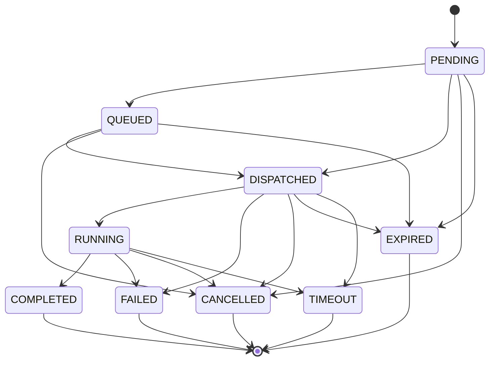
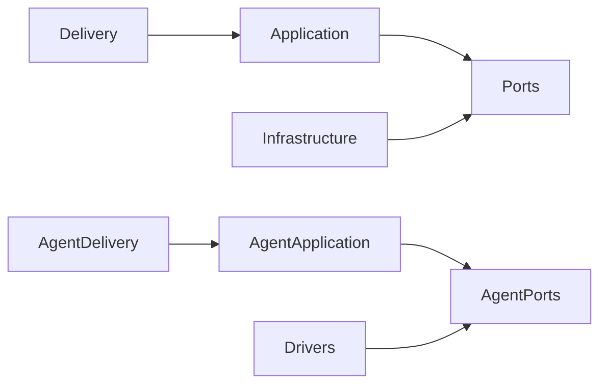

# Components

## Purpose

Describe component ownership and permitted dependencies.

## Scope

Applies to planned server, agent, shared contracts, and operations components.

## Architecture

| Component | Owns | Depends on |
| --- | --- | --- |
| Web/API adapter | HTTP, UI delivery, auth boundary | application services |
| WebSocket Gateway (implemented) | session lifecycle, framing, delivery | protocol + application services |
| Command Dispatcher (implemented) | discovery, priority queue, delivery, ack/timeout/retry | application services + WebSocket Gateway's SessionManager |
| Server services | commands, schedules, policies, files | repository and external-service ports |
| Repository adapters | PostgreSQL persistence | database client |
| Agent Framework (implemented, Phase 1) | process lifecycle, connection management, protocol handling, plugin loading, logging, metrics, health | `shared/protocol/` |
| Agent services (future) | sync, dispatch, outbox beyond the framework above | driver/repository/network ports |
| Drivers (future) | GPIO, camera, sensor specifics | hardware libraries only |
| Shared contracts (implemented) | protocol schemas, identifiers | no infrastructure |

### Device Registry (implemented)

The first server component built to this design is the Device Registry (`server/app/domains/devices/`), which owns the logical inventory of compute nodes independent of any communication channel. It follows the same inward-pointing dependency rule as the rest of this document at file granularity within one domain package:

| File | Owns | Depends on |
| --- | --- | --- |
| `api.py` | REST delivery, request/response wiring, per-request DI | the devices application service, `schemas.py` |
| `service.py` | Registration, lifecycle, and capability-replacement rules | `repository.py`, `exceptions.py` |
| `repository.py` | All device/capability persistence and querying | `models.py`, a caller-owned `AsyncSession` |
| `models.py` | SQLAlchemy tables (`devices`, `device_capabilities`) | SQLAlchemy only |
| `schemas.py` | Pydantic request/response contracts and field validation | `models.py` (for `DeviceStatus`) |
| `exceptions.py` | Domain failures (`DeviceAlreadyExists`, `DeviceNotFound`, `DuplicateCapability`, `InvalidHeartbeat`) | nothing |

There is no `mapper.py` in this domain anymore — mapping a persisted `Device` to a response shape is the application layer's job now (see below), not the domain's.

A **Device** is a logical compute node — a Raspberry Pi, an ESP32, a VM, or a container — never assumed to be any one of these. What a device can do is expressed entirely through its declared **capabilities** (`gpio`, `camera`, `filesystem`, `scheduler`, `soil_sensor`, `relay`, `temperature`, `humidity`, `pump`, `led`, and any future hardware type), which are stored as free-form strings rather than an enum specifically so new hardware types never require a server code change or migration. Application code must dispatch on capability name/version, never on an assumed device type.

No Raspberry Pi communication, WebSocket transport, authentication, or command execution exists yet; this phase only registers, updates, and queries devices administratively over REST.

### Command domain (implemented)

The second implemented component is the Command domain (`server/app/domains/commands/`) — the central business domain of Sam's Lab. Every action a device performs is represented as a command; the domain owns command *lifecycle*, never device *execution*:

| File | Owns | Depends on |
| --- | --- | --- |
| `api.py` | REST delivery, request/response wiring, per-request DI | the commands application service, `schemas.py` |
| `service.py` | The explicit state machine and all lifecycle transitions | `repository.py`, `exceptions.py` only |
| `repository.py` | All command/result/event persistence and querying | `models.py`, a caller-owned `AsyncSession` |
| `models.py` | SQLAlchemy tables (`commands`, `command_results`, `command_events`) | SQLAlchemy only |
| `schemas.py` | Pydantic request/response contracts | `models.py`, `validators.py`, `events.py` |
| `validators.py` | Reusable field rules (`command_type` pattern, expiration-window checks) | nothing |
| `events.py` | The closed `CommandEventType` enum | nothing |
| `exceptions.py` | Domain failures (`CommandNotFound`, `InvalidStateTransition`) | nothing |

There is no `mapper.py` here either, and — unlike an earlier revision of this domain — `service.py` no longer depends on devices' `DeviceRepository` at all. See "Design rule" below.

**Philosophy:** a command is created once and is immutable — its `payload` is never rewritten. It only ever progresses through `status` (and the timestamps that go with each transition), and every transition appends a `CommandEvent` row rather than overwriting anything. A terminal outcome is stored as exactly one `CommandResult` row, kept separate from the command itself.

**The explicit state machine** (`service.py`, `ALLOWED_TRANSITIONS`) is the single source of truth for which `status → status` transitions are legal:

`COMPLETED`, `FAILED`, `CANCELLED`, `EXPIRED`, and `TIMEOUT` are terminal — nothing transitions out of them, enforcing "completed commands cannot restart." `expire_old_commands()` sweeps commands whose `expires_at` has passed: a command still queued becomes `EXPIRED`, one already `RUNNING` becomes `TIMEOUT` — one column and one sweep serve both semantics without a redesign.

**Command types are never hardcoded.** `command_type` is validated only as a lowercase, dot-namespaced string (`pump.start`, `camera.capture`, `filesystem.upload`, `system.reboot`, `sensor.read`, and any future plugin's own type) — the server never branches on device type or command type; it only manages lifecycle. Priority ordering (`LOW`/`NORMAL`/`HIGH`/`CRITICAL`) is resolved through an explicit rank map in the repository, not string comparison, so a `find_pending`/`sort=priority` query returns real dispatch order.

**Design rule — the Command domain never talks to devices, and never talks to the Device Registry domain either.** `CommandService` depends only on its own repository; it has no import of devices' `DeviceRepository`, `DeviceService`, or exceptions. Confirming a command's target device exists and is enabled is a cross-domain rule, and it is enforced by `CommandApplicationService` in the application layer below — not by either domain. Neither domain ever opens a connection to a device, imports a driver, or contains WebSocket/transport code. Dispatch, execution, and result reporting are handled by the Command Dispatcher (see below), which calls the `mark_dispatched`/`mark_running`/`mark_timeout`/`record_retry`/`complete_command`/`fail_command`/`expire_old_commands` application-service methods — the Command domain itself still never initiates any of this; it only exposes the state machine and persistence those calls need.

### The Application Layer (implemented)

`server/app/application/` is not a business domain — it coordinates domain services to implement use cases that span more than one of them, and it is the *only* place allowed to do so:

| Package | Owns | Depends on |
| --- | --- | --- |
| `services/` | `DeviceApplicationService`, `CommandApplicationService`, `HealthApplicationService` — one high-level use case per domain method, translated errors, published events | domain services (never repositories), `dto/`, `mappers/`, `exceptions/`, `events/`, `validators/` |
| `dto/` | Transport-agnostic response shapes (`DeviceDTO`, `CommandDetailDTO`, ...) | nothing domain-specific beyond a domain's plain enums (e.g. `DeviceStatus`) |
| `mappers/` | The *only* code that reads a SQLAlchemy model's attributes on the way out to a DTO | `dto/`, domain `models.py` |
| `exceptions/` | The `ApplicationError` hierarchy (`NotFoundError`, `ConflictError`, `ApplicationValidationError`) plus `translate_domain_error()` | domain exception modules (to build the translation map) |
| `events/` | `EventBus` (subscribe/publish/unsubscribe, in-process only) and the domain event dataclasses it carries (`DeviceRegistered`, `DeviceHeartbeat`, `CommandCreated`, `CommandDispatched`, `CommandCompleted`, `CommandFailed`, `CommandTimedOut`, and the WebSocket Gateway's `CommandAckReceived`/`CommandResultReceived`) | nothing domain-specific |
| `validators/` | Centralized `PaginationParams` and `validate_sort_field`, shared by every list use case instead of being redeclared per controller | `exceptions/` |
| `interfaces/` | Abstract contracts with no implementation yet: `Clock`, `IdGenerator`, `ObjectStorage`, `NotificationSender`, `AuditRecorder`, `CurrentUserProvider`, `UnitOfWork` | nothing |

A REST controller (a domain's `api.py`) depends only on one application service and contains no logic beyond resolving that service via `Depends` and returning what it produces — never a domain service, never a repository, never `HTTPException` for a domain failure. `app/main.py` registers exactly one exception handler, for `ApplicationError`, so REST's error-to-status-code mapping never needs to know a specific domain's exception types.

### The WebSocket Gateway (implemented)

`server/app/websocket/` is a transport layer, not a business domain: it maintains authenticated agent sessions and delivers protocol messages, and never executes a command, accesses GPIO, or accesses a repository directly.

| File | Owns | Depends on |
| --- | --- | --- |
| `router.py` | The WS route (path from `Settings.websocket_path`), the read-only `GET /ws/sessions`/`GET /ws/sessions/{device_id}` admin endpoints (`RequirePermission("system.admin")`), and `/metrics` | `gateway.py`, `manager.py`, the Auth domain's `RequirePermission` |
| `gateway.py` | The full connection lifecycle: accept, handshake/auth, register, heartbeat + receive loop, cleanup | `connection.py`, `manager.py`, `heartbeat.py`, `handlers.py`, `protocol.py`, `serializer.py`, the Auth core (`decode_principal`/`JWTCodec`), `DeviceApplicationService` |
| `manager.py` | The in-memory `SessionManager` — one `Session` per `device_id`, `register`/`unregister`/`get`/`list_sessions`/`send`/`broadcast`/`disconnect`, plus tracking in-flight connection tasks for graceful shutdown | `session.py`, `schemas.py` |
| `session.py` | The `Session` dataclass and `ConnectionState` enum | `connection.py`, the Auth domain's `Principal` |
| `connection.py` | One socket's bounded outgoing queue, backpressure, ack/retry/timeout tracking, and incoming duplicate detection | `schemas.py`, `serializer.py`, `protocol.py` |
| `heartbeat.py` | `HeartbeatMonitor` — periodic PING and both heartbeat- and idle-timeout detection | `connection.py`, `session.py`, `protocol.py` |
| `handlers.py` | Generic, business-logic-free per-message-type handling (PING/PONG, MESSAGE_ACK, ERROR, the generic ack for COMMAND/EVENT/LOG, and publishing `CommandAckReceived`/`CommandResultReceived` for COMMAND_ACK/COMMAND_RESULT) | `connection.py`, `session.py`, `protocol.py`, the application event bus |
| `protocol.py` | `MessageType`, `PROTOCOL_VERSION`/`SUPPORTED_PROTOCOL_VERSIONS`, `negotiate_protocol_version` | `exceptions.py` |
| `schemas.py` | The `Envelope` and every payload Pydantic model, plus the admin `SessionSummaryDTO` | `protocol.py` |
| `serializer.py` | `serialize`/`deserialize` — the only place JSON (de)serialization happens | `schemas.py`, `exceptions.py` |
| `metrics.py` | Process-global Prometheus `Counter`/`Gauge`/`Histogram` objects (an intentional, narrow exception to "no module-level singletons") | `prometheus_client` only |
| `constants.py` | Fixed, non-configurable values (`MAX_SEEN_MESSAGE_IDS`, `CloseCode`, ...) | nothing |
| `exceptions.py` | Transport-only failures (`AuthenticationFailedError`, `ProtocolViolationError`, `DuplicateSessionError`, `BackpressureExceededError`, ...), never a domain exception | nothing |

The gateway's one cross-domain call is through `DeviceApplicationService` (confirming a device is enabled at handshake time, and keeping `last_seen`/`status` current) — the same Application Layer seam REST already uses, so a future MQTT or gRPC transport could reuse it identically. Sessions are never persisted; `SessionManager` is a per-application-instance singleton (`app/core/container.py`), and the application `lifespan` waits for every in-flight connection task to finish before disposing shared infrastructure on shutdown.

### The Command Dispatcher (implemented)

`server/app/dispatcher/` is a background service, not a business domain: it delivers commands to connected devices, tracks their acknowledgement/execution, and retries transport failures — it never executes a command, never knows command semantics beyond `command_type`/`payload` as opaque values, and never accesses a repository directly.

| File | Owns | Depends on |
| --- | --- | --- |
| `dispatcher.py` | The composition root: `CommandDispatcher` (start/stop/`is_running`/`health_ok`, admin accessors) and `CommandGateway` (one short-lived `CommandApplicationService` transaction per operation) | every other file in this package, `CommandApplicationService`, `Database`, `EventBus` |
| `worker.py` | `DispatchWorker` — polls `list_pending`, queues by priority, drains the queue against connected devices | `queue.py`, `delivery.py`, `ack_manager.py`, `interfaces.py`, `events.py` |
| `delivery.py` | `DeliveryService` — connectivity check plus handing one COMMAND envelope to `SessionManager` | `interfaces.py` (`DeviceSessionPort`), `app/websocket/schemas.py`/`protocol.py` |
| `ack_manager.py` | `AckManager` — tracks DISPATCHED commands awaiting `COMMAND_ACK`; retry-with-backoff, then `fail_command` | `retries.py`, `interfaces.py`, `events.py`, `config.py` |
| `timeouts.py` | `TimeoutMonitor` — tracks RUNNING commands awaiting `COMMAND_RESULT`; `mark_timeout` if the window elapses | `interfaces.py`, `config.py` |
| `result_handler.py` | `ResultHandler` — resolves a tracked command's `COMMAND_RESULT` into `complete_command`/`fail_command`; drops duplicates/unknowns | `interfaces.py`, `timeouts.py` |
| `queue.py` | `DispatchQueue`/`QueuedCommand` — the in-memory CRITICAL>HIGH>NORMAL>LOW, FIFO-within-priority queue | `app/domains/commands/models.py` (`CommandPriority`) only |
| `retries.py` | Pure backoff/retry-decision math (`compute_backoff_seconds`, `should_retry`) | nothing |
| `interfaces.py` | `Protocol` contracts (`CommandLifecyclePort`, `DeviceSessionPort`, `CommandDeliveryPort`) so submodules never import the composition root | `app/application/dto/command_dto.py`, `app/websocket/schemas.py`/`session.py` |
| `events.py` | Dispatcher-only operational events (`CommandQueued`, `DeliveryFailed`, `DispatchRetryScheduled`, `DispatchExhausted`) published on the shared event bus, distinct from the Command domain's own lifecycle events | nothing |
| `metrics.py` | Process-global Prometheus metrics (same exception to "no module-level singletons" as the WebSocket Gateway's) plus `read_counter`/`read_gauge` helpers for the admin `/dispatcher/statistics` endpoint | `prometheus_client` only |
| `config.py` | `DispatcherConfig` — one immutable snapshot of every `DISPATCHER_*` setting, built once at startup | `app/config/settings.py` |
| `exceptions.py` | `DispatcherError`/`DeliveryFailedError` (raised only for a connected device's full outgoing queue — a routine "not connected" is a plain `False`, never an exception) | nothing |

Admin REST endpoints live outside this package, in `app/api/dispatcher.py` (matching `app/api/health.py`'s pattern) — the dispatcher package itself has no FastAPI import anywhere. `GET /dispatcher/status`, `/queue`, `/running`, and `/statistics` are read-only and gated by `RequirePermission("system.admin")`, resolving the dispatcher singleton (`app/core/container.py`) and calling its accessor methods. `/ready` also reports `unhealthy` if a dispatcher that successfully started later stops (its worker task died) — a dispatcher that never started (no database configured) is not itself a readiness failure.

### Shared protocol contracts (implemented)

`shared/protocol/` (`schemas.py`, `message_types.py`, `serializer.py`, `exceptions.py`) holds the canonical `Envelope`/payload Pydantic models, `MessageType`, `serialize`/`deserialize`, and the protocol-only exception hierarchy (`ProtocolError` → `ProtocolViolationError`/`ProtocolVersionUnsupportedError`) — a pydantic-only package with no transport or infrastructure dependency, importable by both `server/app/websocket/` and `agent/app/protocol/`. `server/app/websocket/{schemas,protocol,serializer,exceptions}.py` are thin re-export shims over it, so every existing gateway import path is unchanged; `SessionSummaryDTO` (a gateway admin-endpoint DTO, not a wire-protocol shape) is the one thing that still lives only in `server/app/websocket/schemas.py`.

### Agent Framework (implemented, Phase 1)

`agent/` is its own installable package — a separate `pyproject.toml`, `pythonpath`, and mypy/ruff config from `server/`, so its `agent/app/` and the server's `server/app/` never collide as top-level `app.*` imports. This phase implements the production-ready framework only: process lifecycle, connection management, protocol handling, plugin loading, logging, metrics, and health. No GPIO, camera, scheduler, SQLite, or S3 code exists yet — see [Agent design](../agent/AGENT.md) for what's planned on top of this framework, and the Command Runtime below for what Phase 2 added on top of it.

| File/Package | Owns | Depends on |
| --- | --- | --- |
| `config/settings.py` | `AgentSettings` (Pydantic Settings) and `load_settings()` (env/`.env`, then CLI overrides) | `pydantic-settings` only |
| `state/machine.py` | `AgentState`, `ALLOWED_TRANSITIONS`, `ensure_transition_allowed()`, `StateMachine` | `state/exceptions.py` |
| `protocol/handlers.py` | Pure HELLO/WELCOME/PING/PONG/ERROR/GOODBYE envelope construction/parsing; no I/O | `shared/protocol/` |
| `connection/manager.py` | `ConnectionManager` — connect/authenticate/send/receive/heartbeat/disconnect/reconnect | `connection/transport.py` (the `WebSocketConnection` seam), `connection/backoff.py`, `protocol/`, `services/session.py`, `state/`, `metrics/` |
| `dispatcher/dispatcher.py` | `MessageDispatcher` — routes a received envelope by `message_type`; an unregistered type is logged and ignored. `COMMAND` is registered to the Command Runtime below | `shared/protocol/` |
| `services/session.py` | `SessionState` — connected/authenticated, connection ID, protocol/agent/server version, heartbeat timestamps; never persisted | nothing |
| `plugins/{base,registry}.py` | `Plugin` base class and `PluginManager` — capabilities, ordered startup/reverse-ordered shutdown hooks, aggregated health; no real plugin yet | nothing |
| `health/{checks,results,service}.py` | Five checks (connection, configuration, plugins, memory, disk) combined via `combine_states()` into one `HealthState` | `config/`, `services/session.py`, `plugins/` |
| `lifecycle/{orchestrator,factory}.py` | `Agent` (startup, concurrent heartbeat/receive loops, reconnect-with-backoff, graceful shutdown including draining in-flight commands) and the composition root (`build_agent`/`build_health_service`, which also wires up the Command Runtime below) | every package above, `commands/` |
| `logging/configure.py` | structlog JSON configuration; `bind_context`/`clear_context` for device/connection/message/correlation/trace IDs | `structlog` only |
| `metrics/registry.py` | Process-global Prometheus metrics (the same narrow exception to "no module-level singletons" as the server's gateway/dispatcher metrics) | `prometheus_client` only |
| `system/{signals,directories}.py` | Signal-driven graceful shutdown; local data/cache/tmp directory creation | stdlib only |
| `cli/main.py` | `samslab-agent`: `start`/`version`/`health`/`config`/`validate-config` (`argparse`) | `lifecycle/factory.py`, `config/`, `logging/`, `system/` |
| `utils/version.py` | `AGENT_VERSION` | nothing |

### Command Runtime (implemented, Phase 2)

`agent/app/commands/` receives, validates, acknowledges, dispatches, executes, and reports on commands — transport-independent, and unaware of any handler's own implementation (no GPIO/camera/pump-specific code anywhere in this package). `CommandDispatcher.handle_command` is registered on `dispatcher/dispatcher.py`'s `MessageDispatcher` for `MessageType.COMMAND` in `lifecycle/factory.py`, the one seam between transport and this package. See [Agent design](../agent/AGENT.md#command-runtime-implemented-phase-2) and [Commands](../agent/COMMANDS.md) for the full lifecycle/protocol narrative.

| File | Owns | Depends on |
| --- | --- | --- |
| `handler.py` | `CommandHandler` ABC — `command_type`/`validate()`/`execute()` mandatory, `supports()`/`timeout()` overridable with defaults | `context.py` (type-only, via `TYPE_CHECKING`) |
| `registry.py` | `CommandRegistry` — `register()`/`unregister()`/`find_handler()`/`list_handlers()`; `register()` rejects a duplicate `command_type` | `handler.py`, `exceptions.py`, `metrics.py` |
| `context.py` | `CommandContext` (frozen) and `CommandServices` (frozen: `plugin_manager`, `health_service`, `registry`, `agent_started_at`) — built fresh per command by `build_command_context()` | `config/`, `health/`, `plugins/`, `shared/protocol/` |
| `executor.py` | `CommandExecutor` — timeout (`asyncio.wait_for`), cancellation (`cancel(command_id)`), retries (`ExecutorConfig`, disabled by default, `FAILED`-only), duration/outcome metrics | `context.py`, `handler.py`, `result.py`, `metrics.py` |
| `dispatcher.py` | `CommandDispatcher` — parse → lookup → `validate()` → `COMMAND_ACK` → execute → `COMMAND_RESULT`, each command as its own task so one never blocks another or the receive loop; a top-level exception handler is the transport's safety net | `registry.py`, `executor.py`, `context.py`, `lifecycle.py`, `result.py`, `shared/protocol/` |
| `result.py` | `CommandResult` (frozen), `CommandResultStatus` (`SUCCESS`/`FAILED`/`CANCELLED`/`TIMEOUT`), shell-convention exit codes | nothing |
| `lifecycle.py` | `CommandLifecycleState`, `ALLOWED_TRANSITIONS`/`ensure_transition_allowed()`, `CommandLifecycle` (publishes a `CommandEvent` per transition) | `events.py`, `exceptions.py`, `result.py` |
| `events.py` | `CommandEventBus` — synchronous subscribe/unsubscribe/publish keyed by lifecycle state, scoped to this package | nothing |
| `validators.py` | `validate_command_type_format()`, `require_keys()`, `require_type()` | `exceptions.py` |
| `metrics.py` | `commands_received_total`/`commands_completed_total`/`commands_failed_total`/`commands_timeout_total` (by `command_type`), `command_execution_duration_seconds`, `registered_handlers`, `running_commands` | `prometheus_client` only |
| `builtin.py` | `SystemEchoHandler`/`SystemPingHandler`/`SystemCapabilitiesHandler`/`SystemHealthHandler` and `register_builtin_handlers()` — demonstrations of the framework, no hardware | `handler.py`, `context.py`, `registry.py` |

## Design Decisions

Dependencies point inward. Delivery adapters translate transport concerns; services enforce use cases; repository/driver adapters isolate technology.

## Future Considerations

Add independently deployable workers only for workloads such as media processing or notifications.

## Open Questions

Which dependencies can safely be shared between server and agent beyond protocol models?

## References

- [Architecture](ARCHITECTURE.md)
- [Agent design](../agent/AGENT.md)
