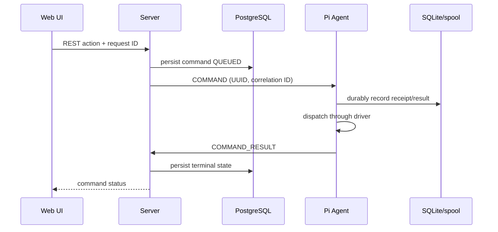
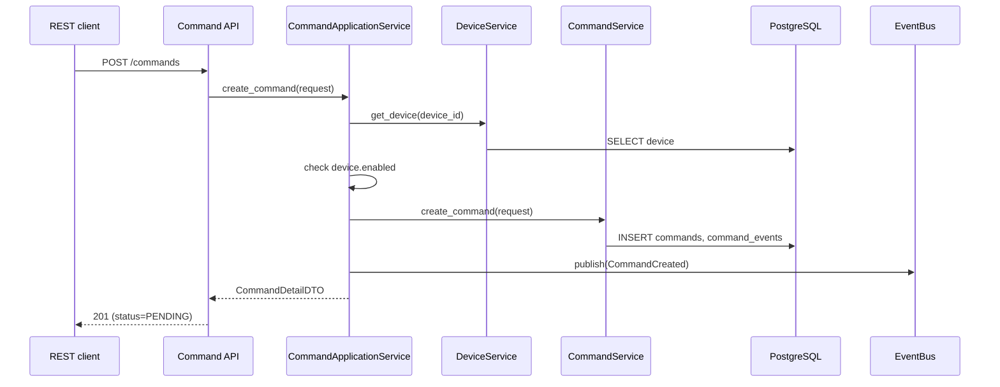
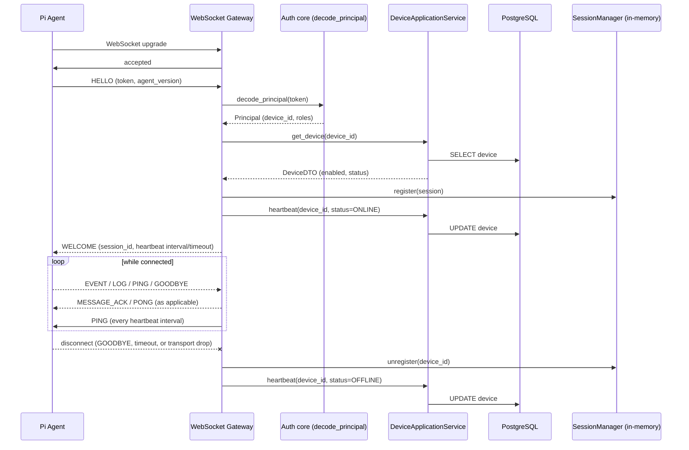
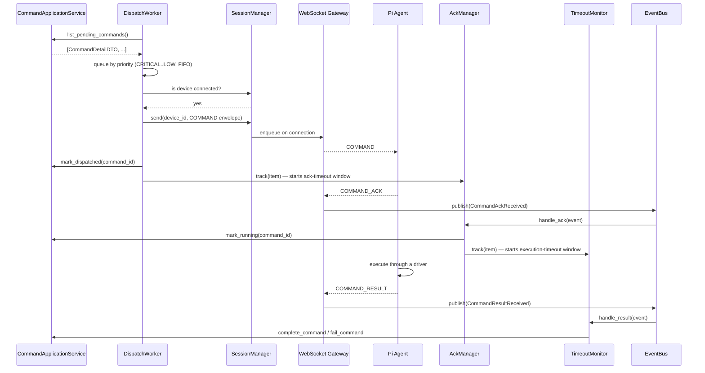
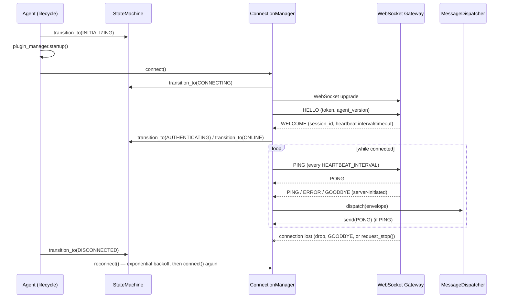

# Data Flow

## Purpose

Document how control, telemetry, logs, and media move through Sam's Lab.

## Scope

Covers agent/server flows and durable recovery paths.

## Architecture

Telemetry, events, logs, and metrics originate at the agent; each is framed as a protocol message and retained locally until acknowledged when delivery matters. Media receives an authorized upload destination from the server, uploads over TLS to object storage, then reports metadata to the server.

### Command creation (implemented)

Creating a command only ever persists intent; the application layer, not the Command domain, is what confirms the target device exists and is enabled:

A command sits in `PENDING` — with a durable, queryable record and a `COMMAND_CREATED` event — until the Command Dispatcher (below) discovers and delivers it.

### The WebSocket Gateway connection lifecycle (implemented)

The agent WebSocket carries the protocol in [Protocol](PROTOCOL.md). The connection lifecycle itself — independent of whether any command is ever dispatched over it — is:

### The Command Dispatcher: discovery through completion (implemented)

This is the sequence the very first diagram in this document sketched as the target end state — now real. The dispatcher (`server/app/dispatcher/`) never talks to a device directly; it only ever calls `CommandApplicationService` and the gateway's `SessionManager`, and reacts to `CommandAckReceived`/`CommandResultReceived` events the gateway publishes when it parses an agent's `COMMAND_ACK`/`COMMAND_RESULT`:

Two failure paths run alongside the happy path above, both handled without any REST/agent interaction:

- **No `COMMAND_ACK` in time** — `AckManager`'s sweep retries the send with exponential backoff (1s, 2s, 4s, 8s by default, each attempt recorded via `record_retry`) up to a configurable maximum, then calls `fail_command`.
- **No `COMMAND_RESULT` in time** — once RUNNING, `TimeoutMonitor`'s sweep calls `mark_timeout` if the execution window elapses with no result.

A device that is not connected when the worker checks is never a failure — the command is left queued and retried on the next poll. A late ack/result for a command no longer tracked (already failed, timed out, or completed) is logged and dropped, never reprocessed. See [Components](COMPONENTS.md) for file-level ownership and [Protocol](PROTOCOL.md) for the acknowledgement/retry/timeout semantics.

### The agent's own connect/heartbeat/reconnect loop (implemented, Phase 1)

The sequence above shows the server's view of one connection. This is the agent's own view of the same connection — `agent/app/lifecycle/`'s `Agent.run()`, independent of whether any command is ever dispatched over it:

Every reconnection attempt after the very first goes through `reconnect()`'s backoff, whether the first attempt failed outright or an established connection was lost later — a dropped connection never hot-loops. `COMMAND` messages are received and would reach `MessageDispatcher.dispatch()`, but no handler is registered for them yet, so they are logged and ignored; wiring real command execution into this loop is future work. See [Agent design](../agent/AGENT.md) and [Components](COMPONENTS.md) for file-level ownership.

## Design Decisions

- Command status is durable on both sides until reconciliation.
- Event ordering is scoped to an agent stream and sequence number.
- Metrics use Prometheus-compatible collection, not command transport.

## Future Considerations

Introduce batching, compression, dead-letter review, and media processing queues as traffic grows.

## Open Questions

What delivery guarantee is needed for each event class?

## References

- [Protocol](PROTOCOL.md)
- [Commands](../agent/COMMANDS.md)
