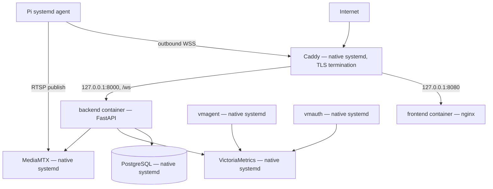

# Deployment

## Purpose

Describe secure, reproducible deployment topology.

## Scope

One Ubuntu Linux VM and one Raspberry Pi 5. The VM uses a **hybrid deployment
model** (implemented): infrastructure services run natively under systemd;
the two application services (backend, frontend) run in Docker. Container
orchestration beyond Docker Compose, HA/multi-VM, and multi-region remain out
of scope.

## Architecture

### Hybrid deployment (implemented)

PostgreSQL, VictoriaMetrics, vmagent, vmauth, MediaMTX, and Caddy are
installed and managed outside Docker, exactly as they were before this
packaging work — nothing here containerizes or reconfigures them. Only the
backend (FastAPI) and frontend (the operator console, served by nginx) run
in Docker, as exactly two Compose services with no other containers. Caddy
is the only internet-facing process; both application containers bind to
`127.0.0.1` only (see `deployment/docker/docker-compose.yml`), so Caddy's own
reverse-proxy config is what actually terminates TLS and exposes ports 80/443
publicly — see `deployment/caddy/Caddyfile` for a working sample (routes
`/ws` and `/api/*` to the backend, everything else to the frontend).
Application containers reach native services over the network by
configurable hostname/IP (`DATABASE_URL`, `MEDIAMTX_HOST`,
`VICTORIA_METRICS_URL` in `deployment/docker/.env`) — they never assume
`localhost` resolves to a native service, since `localhost` inside a
container is the container itself.

Both images are built multi-stage (`deployment/docker/Dockerfile.backend`,
`Dockerfile.frontend`): a build stage with compilers/Node/npm, and a minimal
runtime stage with no dev tools, no build cache, and a non-root user. The
backend's root filesystem is mounted read-only (`tmpfs` only for `/tmp`); the
frontend's nginx-unprivileged runtime is also read-only, dropping every Linux
capability except the one it genuinely needs back
(`CAP_NET_BIND_SERVICE`, to bind port 80 as a non-root user). Neither
container runs privileged or uses host networking; both restart
`unless-stopped` and carry CPU/memory limits.

`deployment/docker/deploy.sh` is the one command an operator needs
(`git pull && ./deployment/docker/deploy.sh`): it backs up config + database,
builds both images, runs Alembic migrations against native PostgreSQL, starts
containers, waits for health, verifies every dependency (backend, frontend,
PostgreSQL, MediaMTX, VictoriaMetrics) is reachable, and rolls back
automatically if verification fails. See
[Operations](../../OPERATIONS.md) for the full runbook and
`deployment/docker/` for every script (`build.sh`, `rollback.sh`, `upgrade.sh`,
`verify.sh`, `backup.sh`, `restore.sh`, `cleanup.sh`).

The Pi agent's deployment is unchanged by this work — see
`deployment/systemd/samslab-agent.service` and [Agent design](../agent/AGENT.md):
a least-privileged systemd service with restart policy, a persistent state
directory, and outbound-only DNS/TLS access.

## Design Decisions

- Infrastructure stays on systemd; only the two application services are
  containerized — this hybrid split was a deliberate choice, not a stepping
  stone to containerizing everything.
- Deploy immutable, versioned image tags (`APP_VERSION`, defaulting to a git
  short SHA); every deploy records the previously-running version so rollback
  never has to guess what "before" means.
- Migrations run as a controlled release step, via a throwaway container
  built from the exact image about to be deployed — migration code and
  application code can never drift apart.
- Back up PostgreSQL (via `pg_dump`, through a throwaway matching-version
  postgres client container, not a host-installed `pg_dump`) before every
  deployment; `restore.sh` exists and is exercised, not just written.
  MediaMTX's own recordings are explicitly never backed up by this tooling.
- Secrets live only in `deployment/docker/.env` (gitignored, never
  committed); the committed `.env.example` documents every field with no
  real values.
- Application containers bind to `127.0.0.1` only — Caddy is the sole
  internet-facing process, exactly as before this work.

## Future Considerations

Container orchestration beyond Compose, HA database, multiple regions,
GitOps, and remote agent update channels are deferred until required.

## Open Questions

Which backup retention window and alert-delivery channel will be chosen for
production?

## References

- [Operations runbook](../../OPERATIONS.md)
- [Security](SECURITY.md)
- [Observability](OBSERVABILITY.md)
