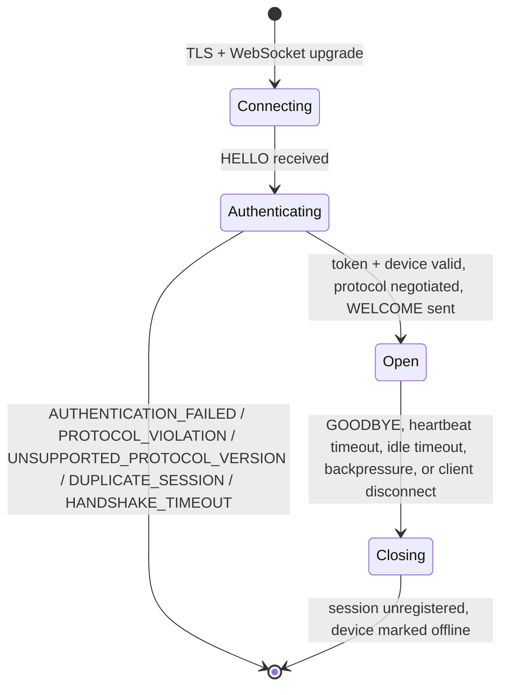

# WebSocket Protocol

## Purpose

Specify the versioned, authenticated server-agent protocol carried over the WebSocket Gateway.

## Scope

Applies only to the persistent outbound agent WebSocket (`server/app/websocket/`); REST APIs are documented separately.

## Architecture (implemented)

The envelope/payload schemas, `MessageType`, and `serialize`/`deserialize` are defined once in `shared/protocol/` — a pydantic-only package with no transport dependency, importable by both the cloud server and the Raspberry Pi agent (`agent/app/protocol/`) — so the two sides share exactly one source of truth for the wire format. `server/app/websocket/{schemas,protocol,serializer,exceptions}.py` re-export the canonical definitions under their original import paths for backward compatibility with the rest of the gateway; `SessionSummaryDTO` (an admin-endpoint response shape, not a wire-protocol message) stays server-side.

Every message is one JSON-encoded envelope, a Pydantic `Envelope` (`shared/protocol/schemas.py`):

```json
{
  "message_id": "uuid",
  "timestamp": "RFC3339 UTC",
  "protocol_version": 1,
  "message_type": "EVENT",
  "payload": {},
  "correlation_id": "uuid | null",
  "trace_id": "string | null"
}
```

`message_type` selects which payload schema validates `payload`; an unrecognized type or a payload that fails its schema is rejected as a protocol violation before it reaches any handler — there is no raw dict manipulation anywhere in the gateway.

| Type | Sender | Payload schema | Purpose |
| --- | --- | --- | --- |
| `HELLO` | agent | `HelloPayload` (token, agent_version, capabilities, resume_cursor) | Mandatory first message; carries the device's bearer/device token |
| `WELCOME` | server | `WelcomePayload` (session_id, server_time, protocol_version, heartbeat interval/timeout) | Handshake acknowledgement |
| `PING` / `PONG` | either | `PingPayload` / `PongPayload` (sent_at) | Liveness probe and reply |
| `COMMAND` | server | `CommandPayload` (command_id, command_type, arguments) | Sent by the Command Dispatcher to deliver one command for execution |
| `COMMAND_ACK` | agent | `CommandAckPayload` (command_id) | Agent accepts a command; promotes it to RUNNING |
| `COMMAND_RESULT` | agent | `CommandResultPayload` (command_id, success, result, error_message) | Agent reports a command's terminal outcome |
| `EVENT` | agent | `EventPayload` (event_type, data) | Agent-originated telemetry/event |
| `LOG` | agent | `LogPayload` (level, message, context) | Forwarded structured log line |
| `ERROR` | either | `ErrorPayload` (code, message, details) | Application-level protocol error |
| `MESSAGE_ACK` | either | `MessageAckPayload` (acknowledged_message_id) | Acknowledges receipt of exactly one prior message |
| `GOODBYE` | either | `GoodbyePayload` (reason) | Graceful, application-level disconnect notice |
| `TERMINAL_OPEN` | server (relaying a browser) | `TerminalOpenPayload` (session_id, cols, rows) | Open, or attach to, one interactive PTY session |
| `TERMINAL_OPENED` | agent | `TerminalOpenedPayload` (session_id, shell) | Confirms a PTY session is open and ready for input |
| `TERMINAL_INPUT` | server (relaying a browser) | `TerminalInputPayload` (session_id, data) | Raw keystroke/paste bytes for the PTY's stdin |
| `TERMINAL_OUTPUT` | agent | `TerminalOutputPayload` (session_id, data) | Raw PTY output bytes, streamed as produced |
| `TERMINAL_RESIZE` | server (relaying a browser) | `TerminalResizePayload` (session_id, cols, rows) | A new terminal window size |
| `TERMINAL_CLOSE` | server (relaying a browser) | `TerminalClosePayload` (session_id, reason) | Terminate one PTY session |
| `TERMINAL_CLOSED` | agent | `TerminalClosedPayload` (session_id, reason, exit_code) | A PTY session has terminated |
| `TERMINAL_ERROR` | agent | `TerminalErrorPayload` (session_id, code, message) | A terminal-session-scoped error |

`COMMAND`, `COMMAND_ACK`, `COMMAND_RESULT`, `EVENT`, and `LOG` all receive a `MESSAGE_ACK` correlated to the original `message_id` — a transport-level delivery acknowledgement the gateway sends for every message of these types, regardless of what (if anything) consumes the message's contents. `COMMAND_ACK` and `COMMAND_RESULT` additionally publish `CommandAckReceived`/`CommandResultReceived` on the shared application event bus, which is how the Command Dispatcher (`server/app/dispatcher/`, see [Architecture](ARCHITECTURE.md) and [Data flow](DATAFLOW.md)) learns of them — the gateway itself never imports or calls the dispatcher directly. `TERMINAL_OPENED`/`TERMINAL_CLOSED`/`TERMINAL_ERROR` follow the identical pattern, publishing `Terminal*Received` events the terminal transport (below) subscribes to; `TERMINAL_OPEN`/`TERMINAL_INPUT`/`TERMINAL_RESIZE`/`TERMINAL_OUTPUT` deliberately receive **no** `MESSAGE_ACK` (`shared/protocol/message_types.TERMINAL_MESSAGE_TYPES` is excluded from `ACK_REQUIRED_MESSAGE_TYPES` the same way `PING`/`PONG` are) — a high-frequency interactive byte stream gains nothing from transport-level ack/retry and would only add latency and out-of-order-redelivery risk.

### Handshake and version negotiation

The gateway accepts every WebSocket upgrade unconditionally, then requires `HELLO` as the *first* application message within `WS_HELLO_TIMEOUT_SECONDS`; anything else is a protocol violation. `HELLO.payload.token` is validated by the same transport-independent Auth core REST uses (`decode_principal`/`JWTCodec`) — a JWT device token, since only device (agent) principals may connect here. The negotiated protocol version is the envelope's own `protocol_version` field, checked against `SUPPORTED_PROTOCOL_VERSIONS` (`app/websocket/protocol.py`); only version `1` exists today, but future versions extend that set rather than replacing it. Because a device token is a stateless JWT with no revocation list, the gateway also performs a live `DeviceApplicationService.get_device()` check at handshake time, so a device disabled after its token was issued is still rejected.



### Session, heartbeat, and delivery

One `Session` exists per authenticated `device_id` (`app/websocket/session.py`), held only in memory by `SessionManager` (`app/websocket/manager.py`) — never persisted, so a server restart drops every session and a second connection attempt for an already-connected device is rejected outright (`DUPLICATE_SESSION`). `HeartbeatMonitor` sends `PING` every `WS_HEARTBEAT_INTERVAL_SECONDS` and closes the connection if no message of any kind (not just `PONG`) updates `Session.last_seen` within `WS_HEARTBEAT_TIMEOUT_SECONDS`; independently, `WS_IDLE_TIMEOUT_SECONDS` closes a connection that has been silent even longer, regardless of the heartbeat cadence. Every successful heartbeat/connect/disconnect also updates the Device Registry's own `last_seen`/`status` through `DeviceApplicationService` — the one Application Layer seam this transport-only gateway is allowed to call.

Outgoing delivery is queued per connection through a bounded `asyncio.Queue` (`app/websocket/connection.py`); `COMMAND`, `COMMAND_RESULT`, `EVENT`, and `LOG` messages are tracked for acknowledgement (`WS_MESSAGE_ACK_TIMEOUT_SECONDS`, retried up to `WS_MESSAGE_ACK_MAX_RETRIES` times, then dropped and logged) and incoming `message_id`s are deduplicated against a bounded recently-seen window, so a resent message is acknowledged again but never reprocessed. A full queue raises immediately rather than blocking or growing unbounded — the connection is closed (`BACKPRESSURE`) rather than let a slow client degrade the server.

### Command dispatch, acknowledgement, retry, and timeout (implemented)

This is a *second*, application-level layer of acknowledgement/retry/timeout on top of the transport-level `MESSAGE_ACK` above — the two are independent and serve different purposes. The Command Dispatcher (`server/app/dispatcher/`) is what actually sends `COMMAND` messages and reacts to `COMMAND_ACK`/`COMMAND_RESULT`; it never touches the WebSocket connection directly, only the gateway's `SessionManager` (to check connectivity and hand off the envelope) and `CommandApplicationService` (to record every lifecycle transition):

- **Acknowledgement window** (`DISPATCHER_ACK_TIMEOUT_SECONDS`) — after sending `COMMAND`, the dispatcher expects `COMMAND_ACK` within this window. No ack in time triggers a resend with exponential backoff (`DISPATCHER_RETRY_BACKOFF_BASE_SECONDS`, doubling, capped at `DISPATCHER_RETRY_BACKOFF_MAX_SECONDS`) up to `DISPATCHER_MAX_RETRIES` attempts, each recorded as a `COMMAND_RETRY_SCHEDULED` audit event; exhausting the budget fails the command.
- **Execution window** (`DISPATCHER_EXECUTION_TIMEOUT_SECONDS`) — once acknowledged (command status `RUNNING`), the dispatcher expects `COMMAND_RESULT` within this window. No result in time transitions the command to `TIMEOUT` — a distinct outcome from a failed acknowledgement, since the agent did accept the command.
- **Duplicates and late arrivals** — an ack or result for a command the dispatcher is no longer tracking (already failed, timed out, or completed) is logged and dropped rather than reprocessed; retries are never issued for an already-acknowledged command.
- **Priority** — a device with multiple pending commands receives them in `CRITICAL > HIGH > NORMAL > LOW` order, FIFO within one priority, via an in-memory queue populated by polling `CommandApplicationService.list_pending_commands()`.

See [Architecture](ARCHITECTURE.md) for how the dispatcher's pieces (`worker.py`, `ack_manager.py`, `timeouts.py`, `result_handler.py`, `delivery.py`) fit together, and [Data flow](DATAFLOW.md) for the full sequence diagram.

### Agent-side command execution (implemented, Phase 2)

The sections above are the server's view of `COMMAND`/`COMMAND_ACK`/`COMMAND_RESULT`. On the agent, `agent/app/commands/` is what actually receives, validates, executes, and replies to them — registered on the agent's own transport-level `MessageDispatcher` for `MessageType.COMMAND`, exactly like `PING`/`PONG`/`ERROR`/`GOODBYE` are registered for their types. The agent's own `CommandDispatcher.handle_command`:

1. Parses `CommandPayload`; a schema failure is logged and dropped (no reply is possible without a `command_id`).
2. Looks up a `CommandHandler` by `command_type` — none found sends a failed `COMMAND_RESULT` immediately, no `COMMAND_ACK`.
3. Calls the handler's own `validate()` — a rejection behaves identically: failed `COMMAND_RESULT`, no `COMMAND_ACK`.
4. Sends `COMMAND_ACK` only once both of the above succeed — matching the meaning `COMMAND_ACK` already has server-side ("agent accepts a command; promotes it to RUNNING").
5. Executes the handler as its own tracked, timeout/cancellation/retry-capable task (never blocking the receive loop or another command), then sends `COMMAND_RESULT`.

See [Commands](../agent/COMMANDS.md) for the agent's own lifecycle state machine (a separate, in-memory, per-command state machine — not the same one as the server's persisted `CommandStatus` above) and [Agent design](../agent/AGENT.md#command-runtime-implemented-phase-2) for the full file-by-file breakdown. The wire messages and schemas themselves are unchanged by this — the agent's richer internal result (status/duration/exit-code/stack-trace) is mapped down to the existing `CommandResultPayload` shape when it's actually sent.

### Interactive terminal sessions (implemented)

`TERMINAL_*` carries a persistent, bidirectional PTY session — deliberately not modeled as a `Command` (see [Terminal](../agent/TERMINAL.md) for the full "stream, not command" rationale). Two WebSocket connections are involved, not one: the agent<->server connection this document otherwise describes (unchanged in its own handshake/session rules, just carrying eight more `MessageType`s), and a *second*, browser-facing WebSocket (`server/app/terminal/`, `WS /ws/terminal/{device_id}`) that a human user's browser opens directly to the cloud server — the one deliberate exception to "the browser never talks to the Raspberry Pi" being about the *Pi*, not about there only ever being one WebSocket. That second connection reuses this same envelope format and the same `HELLO`/`decode_principal()` authentication primitive, just with a **user** JWT instead of a device one (`RequirePermission`-equivalent: `"commands.execute" in principal.permissions`), and relays `TERMINAL_*` messages onward through the *existing* `SessionManager.send()`/agent connection — it does not open a third connection to the agent, and it never touches the Command Dispatcher.

## Design Decisions

- The gateway is a transport layer only: it never executes a command, never accesses GPIO, and never accesses a repository directly — its one cross-domain call is through the Application Layer, the same seam a future MQTT or gRPC transport would use.
- Version negotiation and message validation happen before any handler runs; an unrecognized or malformed message never reaches business logic.
- Delivery is at-least-once for ack-tracked message types; duplicate detection makes reprocessing safe without requiring idempotent handlers at this layer.
- The Command Dispatcher's own ack/retry/timeout tracking is a separate concern from the transport's `MESSAGE_ACK` — losing one doesn't corrupt the other, and the dispatcher never assumes a `MESSAGE_ACK` implies a `COMMAND_ACK`.

## Future Considerations

Add binary media control frames, compression, and capability-specific schemas as concrete interoperability needs emerge. A wire-level `CANCEL` message type would let the server ask a running command to stop — today, cancellation only exists as the agent's own internal `CommandExecutor.cancel()` primitive, not reachable from the server at all.

## Open Questions

Should agent identity add mTLS in addition to the current JWT-bound device credential?

## References

- [API](API.md)
- [Components](COMPONENTS.md)
- [Commands](../agent/COMMANDS.md)
- [Terminal](../agent/TERMINAL.md)
- [Security](SECURITY.md)
